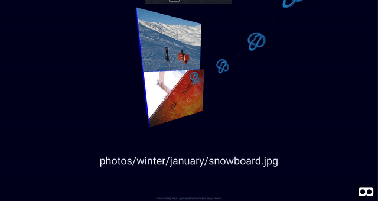

# Sanctuary

Browse your code in peace.

Fly around in 3D and browse a directory tree.



[View Code & Text Preview](example-text.png)

## Running

```bash
npm i -g serve
npm i
```

First, generate the directory listing from the example: `./scripts/list-directory.js example/`

To run: `serve -s -l 5001`
View in your web browser: `localhost:5001`

To clone and add Github repos for viewing (in `scripts/output/cloned-repos/`), run: `./scripts/clone-and-list.js myorg/myrepo`.

## Supports

- Images (`.jpg`, `.png`)
- Code (`.cpp`, `.c`, `.h`)
- Text (`.md`, `.txt`)

### Future Features

- [ ] More file & MIME types (`.svg`, `.mp4`)
- [ ] `q`, `e` for flying `upward`, `downward`
- [ ] Clear 3D default models for directories and files
- [ ] Handlable UI (Focus, Move)
- [ ] Collapsible directories
- [ ] Secondary edges for file hyperlinks
- [ ] Documentation generator support (Doxygen, JSDoc)
- [ ] HTML5 filesystem support (`bro-fs`), for temporary cloned repos
- [ ] Support for VR devices
- [ ] Canvas-based image rendering option
- [ ] 2D analog
